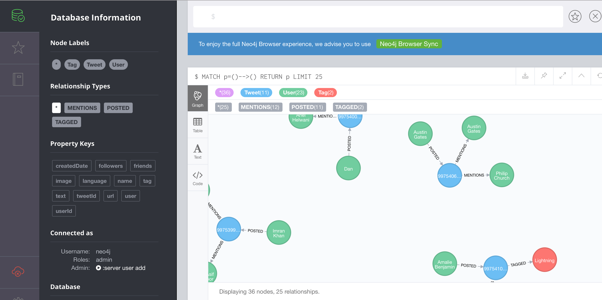

## Twitter Trend Analysis Using neo4j

Using neo4j and Spring Social + Spring REST + Spring DATA neo4j, this application shows:
1. Trending tweets
2. Recommendation engine (friend recommendations)

### Instructions to install

1. Install neo4j 
```
docker run \
    --publish=7474:7474 --publish=7687:7687 \
    --volume=$HOME/neo4j/data:/data \
    --volume=$HOME/neo4j/logs:/logs \
    neo4j
```
neo4j browser url:
```   
http://localhost:7474/
```    
2. Specify following properties in application.properties file
```
#
# neo4j properties
spring.data.neo4j.username=yoursusername
spring.data.neo4j.password=yourspassword
#
# application port
server.port=5050
#
# Twitter credentials
spring.social.twitter.appId=yoursappid
spring.social.twitter.appSecret=yoursappsecret

spring.social.twitter.accessToken=yoursaccesstoken
spring.social.twitter.accessTokenSecret=yoursaccesstokensecret

#
# If true, will start gathering live stream for analytics and scheduled based on -Dgm.twitter.search
# will not occur
gm.twitter.live.stream=false
```

**NOTE** Create twitter consumerKey (spring.social.twitter.appId) and consumerSecret (spring.social.twitter.appSecret)

4. Run the application 
```
mvn spring-boot:run [-Dgm.twitter.search="springsource"]
```

**NOTE** By default there is default neo4j cypher is provided

### REST Metadata APIs
```
http://localhost:5050/users
http://localhost:5050/tweets
http://localhost:5050/tags
 http://localhost:5050/users/search/
```

To find trending tweets use API:
```
http://localhost:5050/tweets/trend
```

neo4j will depict tweets as graphs shown below:

  


    
    
 
